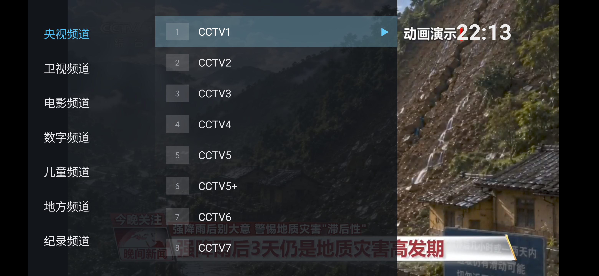

# TV遥控 (tv-remote)

为电视盒子打造的直播播放器：支持自定义视频源（M3U/TXT）、手机扫码遥控、缓存秒开、换源不打断播放。

> 本项目基于 [lizongying/my-tv](https://github.com/lizongying/my-tv) 演进。原版内置的取流接口已失效，本仓库将其重构为**纯播放器**：不包含、不预置任何直播源，频道内容请自行获取并配置。见文末「来源与协议」。

## 功能

* **自定义视频源**：M3U / TXT 格式，远程地址 / 本地文件 / 手机推送均可，多个来源自动按优先级回退
* **手机遥控**：设置页扫码，手机浏览器直接换台、调音量、改源、推送源内容，无需安装任何 App
* **频道列表浮层**：左分组右频道，带频道号与播放标记，选台不遮挡画面
* **秒开与静默刷新**：源缓存本地，启动秒开；每日源更新后台静默拉取，不打断当前播放
* **换台体验**：死链静默重试，不拖动列表焦点；时钟自动校时，失败回退本机时间



## 视频源配置

支持 M3U 与 TXT 两种格式：

```text
# M3U 格式
#EXTINF:-1 tvg-logo="logo地址" group-title="央视",CCTV1
http://example.com/cctv1.m3u8

# TXT 格式
央视,#genre#
CCTV1,http://example.com/cctv1.m3u8
```

按优先级依次尝试，任一成功即生效：

1. **设置页配置地址**：按菜单键打开设置，在「直播源地址」填入 m3u/txt 的 URL
2. **本地文件**：命名为 `my-tv.txt` / `my-tv.m3u`，放到 `/sdcard`、`/sdcard/Download`、U盘根目录，或应用私有目录 `/sdcard/Android/data/com.lizongying.mytv/files/`
3. **手机推送**：设置页扫码打开控制页，把源内容直接粘贴推送给电视（电视访问不了源地址时用）
4. **缓存回退**：断网时自动使用上次成功加载的缓存

## 手机遥控

电视与手机连同一 WiFi，设置页扫码（或浏览器访问 `http://电视IP:9958`）打开控制页：

* 频道列表（分组/搜索）、上下台、音量
* 直播源地址设置、源内容直接推送

接口开放（`GET /`、`GET /status`、`GET /channels`、`POST /play`、`POST /command`、`POST /volume`、`POST /source`），欢迎二次开发。仅限局域网使用。

## 下载

前往 [Releases](https://github.com/huangchengqian/tv-remote/releases) 下载 APK，U盘或 `adb install` 安装。

## 构建

```shell
./gradlew assembleDebug   # 产物在 app/build/outputs/apk/debug/
```

可选：复制 `source.local.properties.example` 为 `source.local.properties` 并填写 `SOURCE_URLS`，可在构建时注入预置源；不创建则构建出纯播放器。该文件不入库。

## 来源与协议

* 本项目基于 [lizongying/my-tv](https://github.com/lizongying/my-tv)（原作者未声明开源协议），原代码版权归原作者所有
* 本仓库在其基础上的修改部分同样暂不声明协议
* 本项目仅供学习研究，禁止用于商业用途；不提供任何视频内容，请使用官方渠道观看
